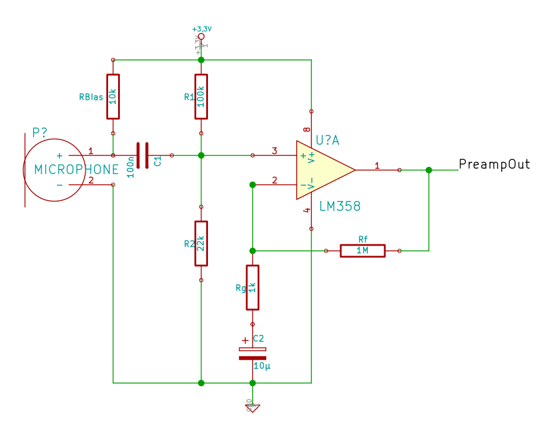
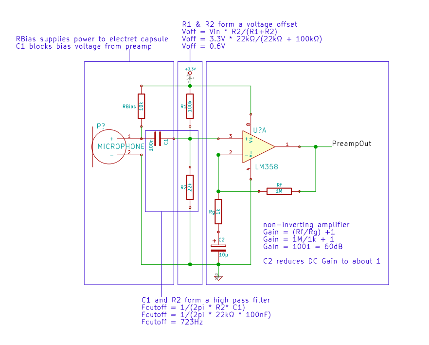
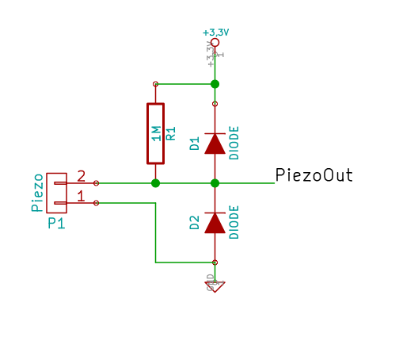

###6.11

###install audio library
	https://www.pjrc.com/teensy/arduino_libraries/Audio.zip

###electret preamp

	The LM358 is a simple single supply OpAmp, we only have one gain stage with a gain of 1000, with the GainBandwithProduct (GBP) of 1MHz (see Datasheet) at unity gain we get about GWP of 1kHz at 1000x gain. => two gain stages would be better (less distortion, more bandwidth)
	besides a TLC272 would be a better but not overly expensive substitude

##Piezo

https://www.pjrc.com/teensy/td_timing_IntervalTimer.html

techniques to remove dc offset:
http://openenergymonitor.org/emon/buildingblocks/digital-filters-for-offset-removal
fixed calibration routine
LPF
HPF

###references
[LM358 Datasheet](http://www.ti.com/lit/ds/symlink/lm158-n.pdf)

[Preampschaltung mit ausführlicher Erklärung](http://www.minidisc.org/mic_preamp/Simple%20Stereo%20Electret%20Mic%20Preamp.htm)

[Opamp Grundschaltungen](https://www.mikrocontroller.net/articles/Operationsverst%C3%A4rker-Grundschaltungen)