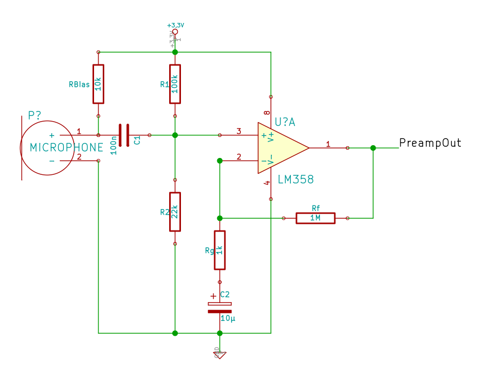
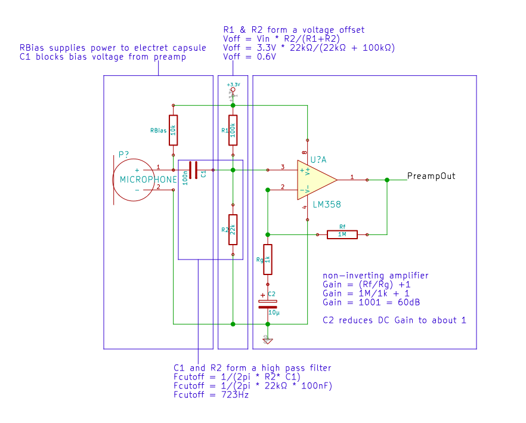
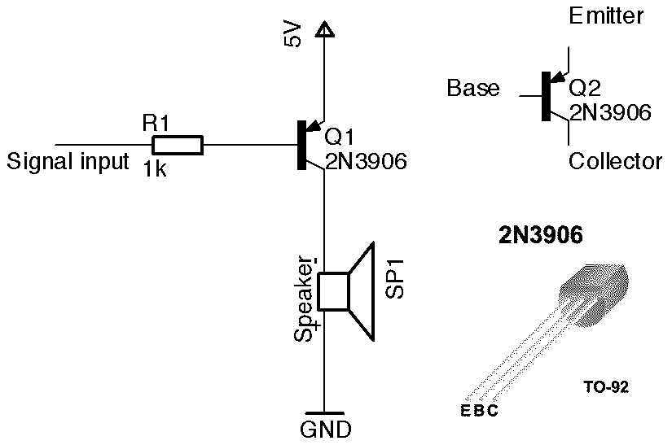

###21.11

###Teensy Audio library
[audio library download](https://www.pjrc.com/teensy/arduino_libraries/Audio.zip)
[overview ](https://www.pjrc.com/teensy/td_libs_Audio.html)

	
design tool

	http://www.pjrc.com/teensy/gui/

###electret preamp

	The LM358 is a simple single supply OpAmp, we only have one gain stage with a gain of 1000, with the GainBandwithProduct (GBP) of 1MHz (see Datasheet) at unity gain we get about GWP of 1kHz at 1000x gain. => two gain stages would be better (less distortion, more bandwidth)
	besides a TLC272 would be a better but not overly expensive substitude

###one transistor speaker amp

###references
[LM358 Datasheet](http://www.ti.com/lit/ds/symlink/lm158-n.pdf)

[Preampschaltung mit ausführlicher Erklärung](http://www.minidisc.org/mic_preamp/Simple%20Stereo%20Electret%20Mic%20Preamp.htm)

[Opamp Grundschaltungen](https://www.mikrocontroller.net/articles/Operationsverst%C3%A4rker-Grundschaltungen)