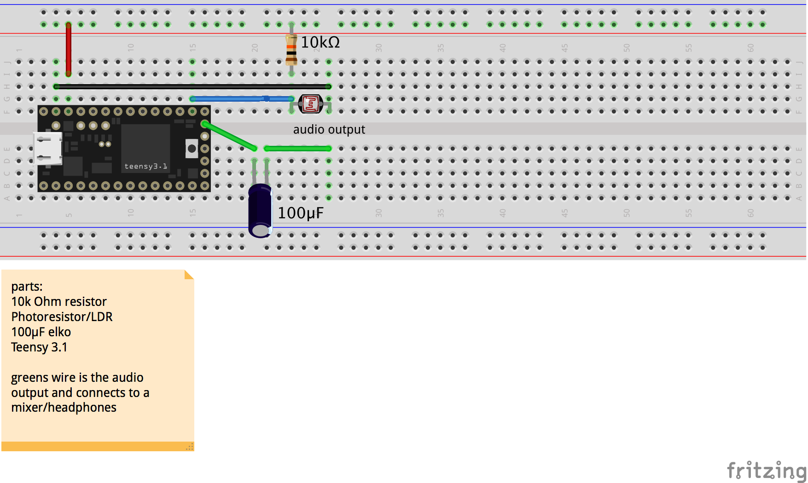
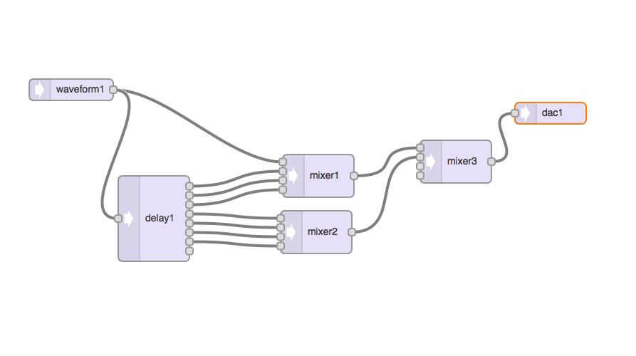

###Lighttable 

"one sensor to rule them all"

Two dimensions are extracted from one simple light sensor. Fast changes in light intensities fill a wavetable (single cycle waveshape), slow or steady movements tune its oscillator in a theremin-typish way. The wavetable is a recording of fluctuations in light intensities and is processed by delaylines to produce an interesting sound.

###breadboard

###audio routing
